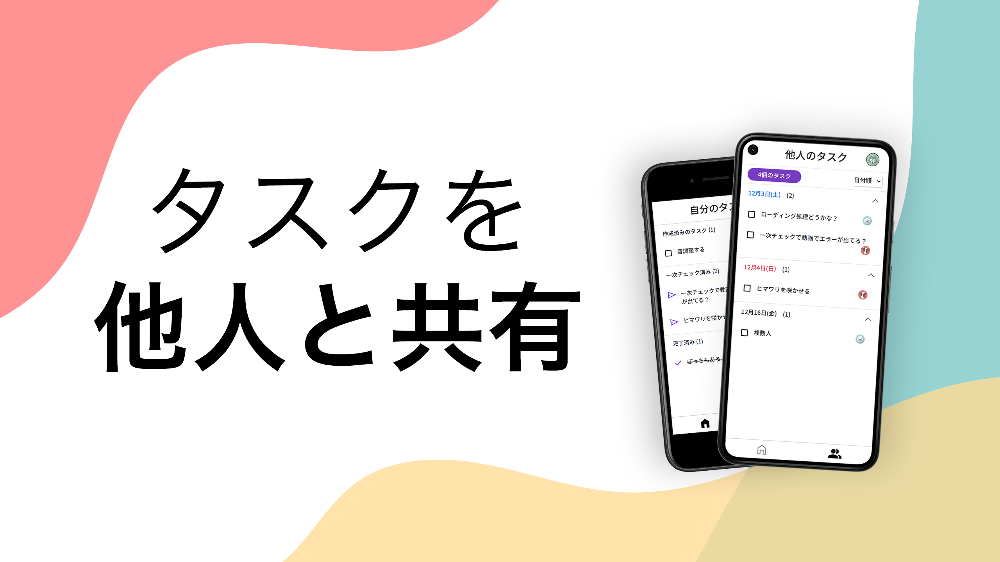
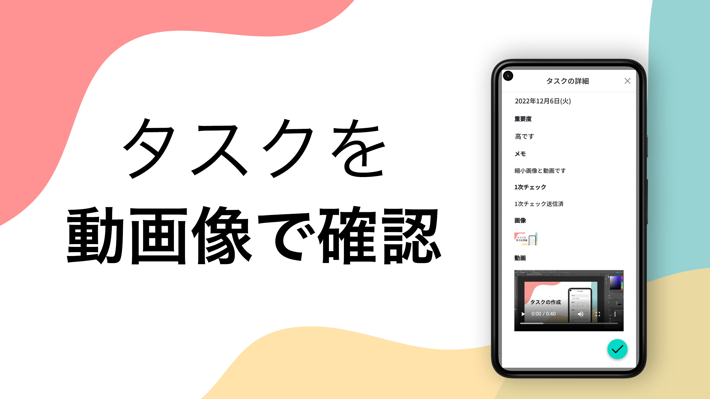
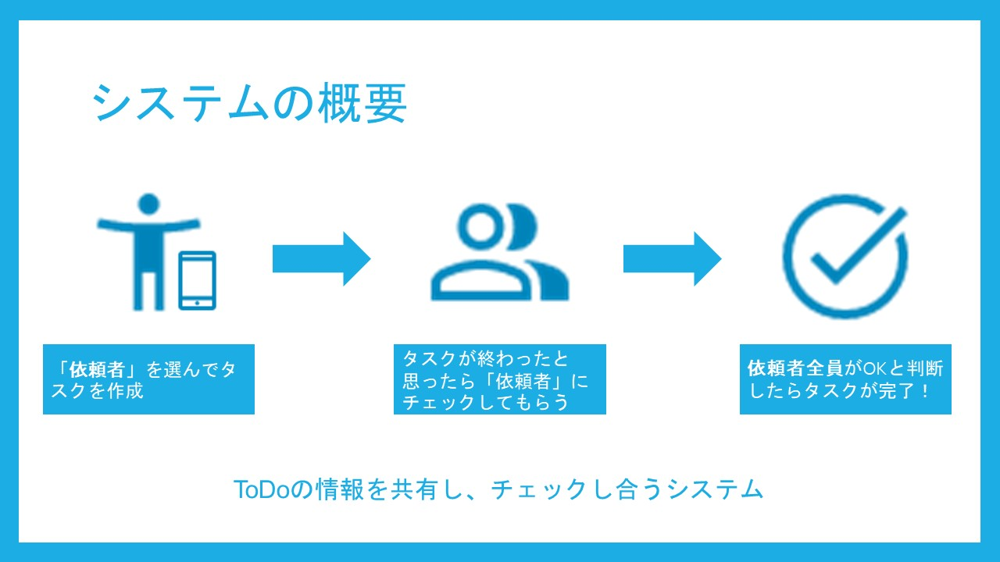
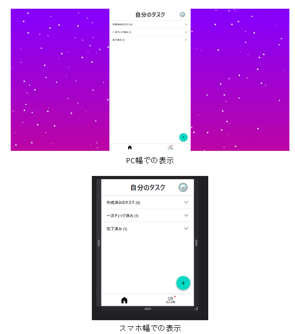

# Together Todo 




# 概要
アプリ名：「Together Todo」

ToDoの情報を共有しチェックし合うシステム。

現在、多くのタスク管理ツールは、ツールにタスクを登録し、登録されたタスクはリスト形式で表示される。その後、登録されたタスクを終えたとき、登録した本人がそのタスクを完了状態にするといったものである。しかし現状の工程では、たとえそのタスクを終えていなかったとしても、本人が完了状態に出来てしまうことである。これではタスクを半端な状態で終えてしまうことが可能であるため、タスク管理ツールの意味が無くなってしまう。<br>
そこで、この問題を解決するToDoの情報を他人と共有しチェックし合うシステム「Together Todo」を開発した。<br>
「Together Todo」は、従来のタスク管理ツールの機能とほとんど同等ではあるが、最も異なる点は、タスクを完了状態にするには、第三者のチェックが必要である点である。これにより、タスクを半端な状態で終えてしまうという問題を解決することができる。

ToDoリストを共有するというアイデアは、Zenlyのような位置情報共有アプリが若者の間で流行したことや教授がGoogle カレンダーでスケジュールの共有し合っていることをヒントに作成した。



# 開発メンバー
- [kuyu0827](https://github.com/kuyu0827)
- [foodcourt1](https://github.com/foodcourt1)
- [muji1213](https://github.com/muji1213)
- [fum1h1to](https://github.com/fum1h1to)

# 使い方
[使い方はこちら](/README-howto.md)

# 工夫点
- アカウント作成時のメール認証
- fetch APIを用いた非同期通信<br>
  ページ遷移を行わずページの一部だけを更新

- PCでもスマホレイアウト<br>
  近年PCからではなくスマートフォンからアプリを扱うことが多い。そのため、新たにPCのデザインを用意するのではなく、スマホレイアウトをPCでも使用。



# 使用技術
### フロントエンド
- HTML, CSS 
- JavaScript
- bootstrap

### バックエンド
- Python
- Django

### その他
- docker

# 構築手順マニュアル

## 開発環境の構築
開発環境にはdockerを用いています。

1. Dockerをインストールする

2. コンテナの作成
    ```
    $ docker-compose up -d
    ```

3. サーバの起動
    まずは、pythonのコンテナに接続
    ```
    $ docker exec -it togeter-todo-python bash
    ```

    そして、サーバを起動<br>
    ※```.env```ファイルがないと起動できません。
    ```
    $ python manage.py makemigrations
    $ python manage.py migrate
    $ python manage.py runserver 0.0.0.0:8888
    ```

4. ブラウザで開く

    ```http://localhost:8888```にアクセスする。

## メールの送信について
メールの送信処理は、GoogleのSMTPを用いて処理しています。<br>
このアプリを実際に動かしたい場合は、下記の手順でメールを送信できるよう設定する必要があります。

### Gmailを使ってメールを送るようにする
0. 必要な場合、メール送信用のgoogleアカウントを作成する。
1. ChromeでGmailにログインします。
2. 自分のアイコンをクリックして「Google アカウントの管理」をクリックします。
3. 画面左側のメニューから「セキュリティ」を選択します。
4. 「Googleへのログイン」の「2段階認証プロセス」を画面の指示に従い有効にします。（すでに完了している場合は、不要）
5. セキュリティのページの「Googleへのログイン」の「アプリ　パスワード」を選択します。
6. 「デバイスを選択」から「その他」を選択して名前を入力します。
7. 「生成」ボタンをクリックすると「お使いのデバイスのアプリ パスワード」が生成されるのでそのパスワードをメモしておきます。

### ```settings.py```及び```.env```への反映。
重要な情報を```settings.py```に反映する際は```.env```を介して反映しています。<br>
```.env```の該当する行に先ほどメモしたパスワード等を反映します。

```
EMAIL_HOST_USER="パスワード生成時に使用したGmailのメールアドレス"
EMAIL_HOST_PASSWORD="Googleで生成したパスワード"
```

例は下記となります。（このコードを反映しても動作しません）
```
DJANGO_SECRET_KEY="-------------------"
DATABASES_NAME="todo"
DATABASES_USER="todoadmin"
DATABASES_PASSWORD="hogehoge"
DATABASES_HOST="db"
DATABASES_PORT="5432"
EMAIL_HOST="smtp.gmail.com"
EMAIL_HOST_PORT="587"
EMAIL_HOST_USER="test.together.todo@gmail.com"
EMAIL_HOST_PASSWORD="abcdefjklmnopqrs"
```
